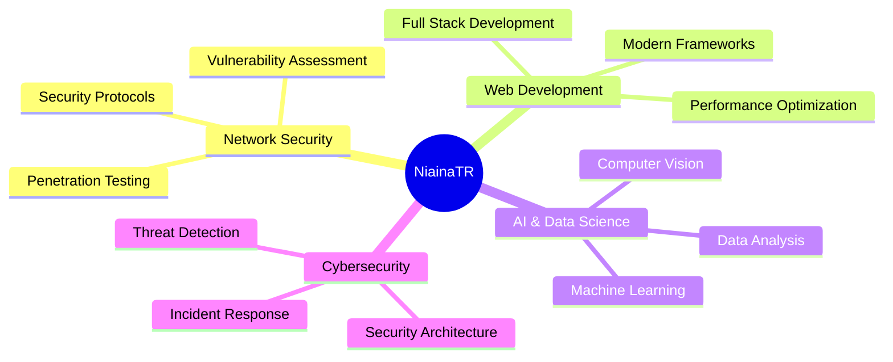

# 👋 Hi there, I'm **NiainaTR**!

<div align="center">
  
</div>

<div align="center">
  
</div>

---

## 🚀 **About Me**


```javascript
const niainaTR = {
    currentFocus: "IT Student 🎓",
    interests: [
        "Network Security 🔐",
        "Cybersecurity 🛡️", 
        "Web Technologies 🌐",
        "AI & Data Science 🤖"
    ],
    lookingFor: "Collaboration opportunities 🤝",
    currentlyLearning: "Advanced networking & security protocols",
    askMeAbout: ["Web Dev", "Cybersecurity", "Data Science"],
    funFact: "I debug code faster than I can explain why it works! 😄"
};
```

---

## 🌐 **Connect With Me**

<div align="center">
  <a href="mailto:tsantaniainaraherison@gmail.com">
    
  </a>
  
</div>

---

## 💻 **Tech Arsenal**

<div align="center">

### **Programming Languages**


### **Frontend Development**


### **Backend & Databases**


### **DevOps & Tools**


### **AI & Data Science**


</div>

---

## 📊 **GitHub Analytics**

<div align="center">
  
  
</div>

<div align="center">
  
</div>

---

## 🏆 **Achievements**

<div align="center">
  
</div>

---

## 📈 **Contribution Graph**

<div align="center">
  
</div>

---

## 🔝 **Top Repositories**

<div align="center">
  
</div>

---

## 🎯 **Current Focus Areas**

<div align="center">



</div>

---

<div align="center">
  
</div>

<div align="center">
  
</div>

---

<p align="center">
  <i>⭐️ From <a href="https://github.com/NiainaTR">NiainaTR</a> with 💙</i>
</p>
